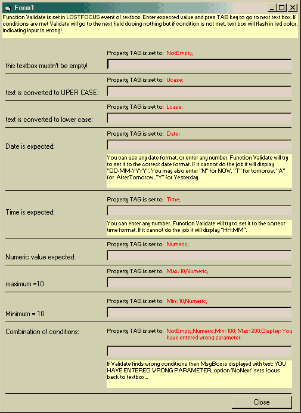



## Validate TextBox

### Description

tis is a simplest way of validating user input. Yust open the project and press F5... check TAG properti in text boxes... You can program validation in RUN TIME or at DEVELOPMENT TIME...
 
### More Info
 

             |
---                |---
**Submitted On**   |2001-12-01 14:36:46
**By**             |[Dobnik Sebastjan](https://github.com/Planet-Source-Code/PSCIndex/blob/master/ByAuthor/dobnik-sebastjan.md)
**Level**          |Intermediate
**User Rating**    |4.9 (44 globes from 9 users)
**Compatibility**  |VB 3\.0, VB 4\.0 \(16\-bit\), VB 4\.0 \(32\-bit\), VB 5\.0, VB 6\.0, VBA MS Access, VBA MS Excel
**Category**       |[String Manipulation](https://github.com/Planet-Source-Code/PSCIndex/blob/master/ByCategory/string-manipulation__1-5.md)
**World**          |[Visual Basic](https://github.com/Planet-Source-Code/PSCIndex/blob/master/ByWorld/visual-basic.md)
**Archive File**   |[Validate\_T387671212001\.zip](https://github.com/Planet-Source-Code/dobnik-sebastjan-validate-textbox__1-29374/archive/master.zip)

